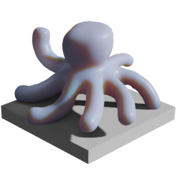

# Octopus Teacher

### Forked From [Wicked Engine](https://github.com/turanszkij/WickedEngine)

## Objectives

* Provide myself a crash-course in modern C++ programming techniques and the latest and greatest in rendering
* Make a cool little octopus demo

## Progress Milestones
### 8/28/2021
* Due to how models were imported, the main transform of the octopus model was being given a `local_scale.z` of -1, which aggrevated the quaterion math for deriving the orientation of the tentacle needed to reach the target. Now fixed using matrix math fully, works when octopus is in any orientation!

### 8/21/2021
* Updated model with subsurface reference material, more tentacle bones, and a bit of webbing

* Naive tentacle script to curl bones around target point - doesn't yet aim towards target, just matches distance

* Code necessary to aim tentale's root bone towards the target, from global to local-bone-space, works great --- except it's requiring using a magic value to reverse the z-axis? Something smells...

* Single tentacle targetting point great! Easily generalize to all tentacles

### 8/19/2021
* Adding new `components` member to existing wiScene to allow for generic component retrievable functions

* Using more ergonomic query system (c++20 is fun!) to get the octopus tentacles out into new vectors for use in procedural animation

* Simple animation to move newly gathered octopus appendages!

* Import and integrate existing `Translator` tool from the Editor project to allow for playing with objects during game execution

* Now with new translator inside the executable, I can successfully have the octopus wear the teapot. Finally.

### 8/18/2021
* Created a simple octopus model in Blender rigged with some tentacle bones

* Exported as .GLB and am able to view in the existing Wicked Engine - Editor

* Went through simple tutorial for setting up 2D and 3D rendering, modify somewhat to allow for strobe lights

